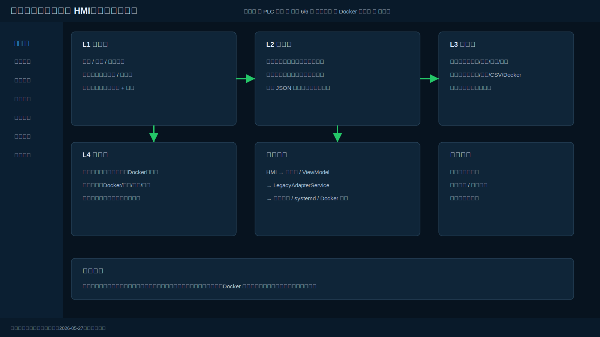
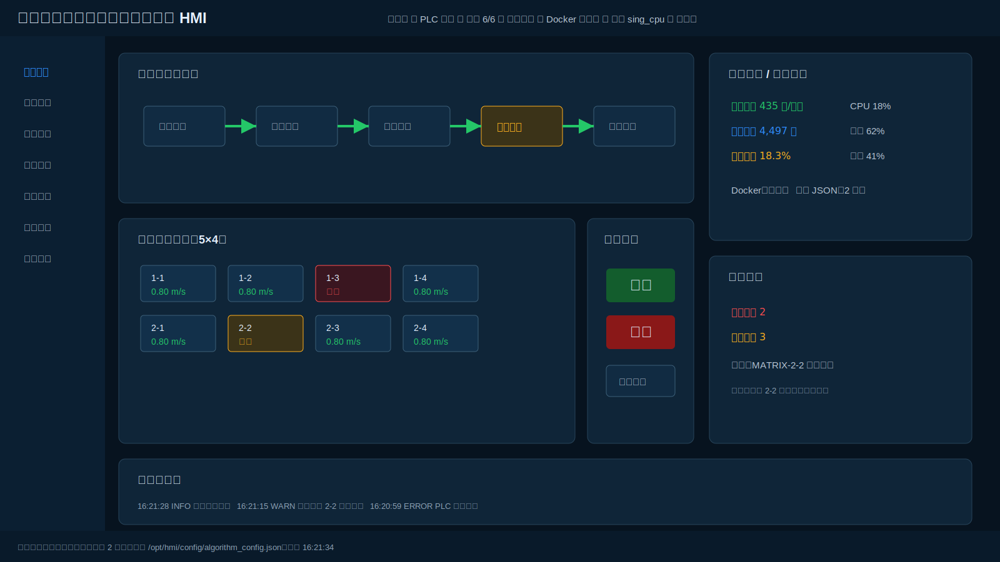
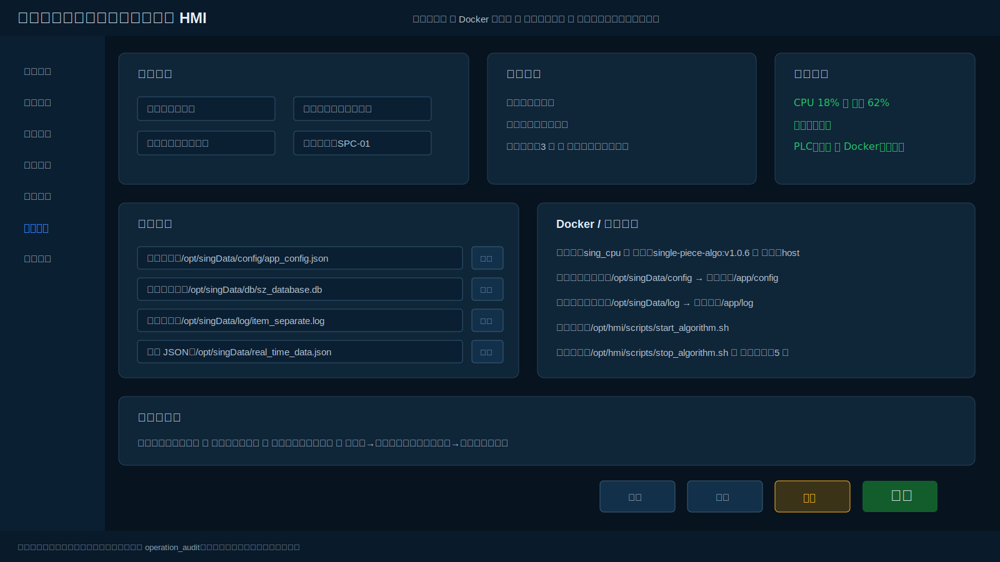
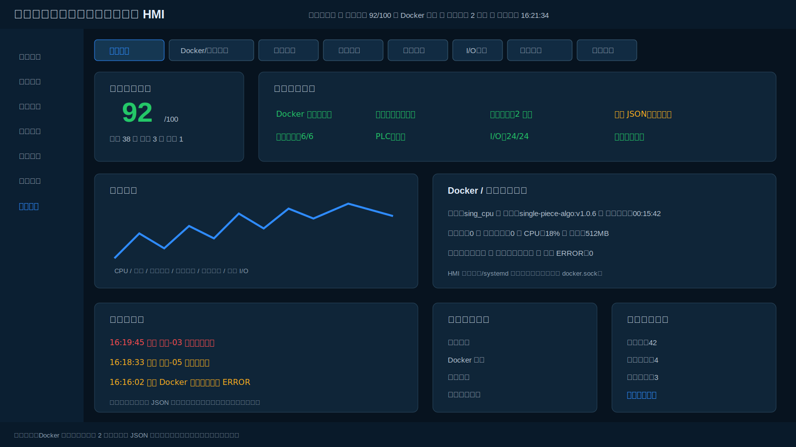
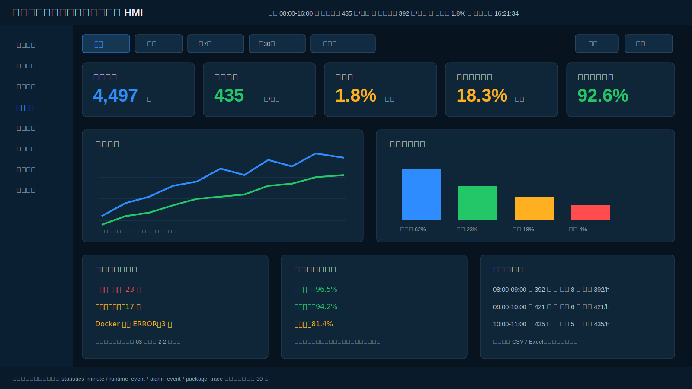

# 自动供件与单件分离 HMI 改造方案

> 版本：2026-05-27  
> 适用项目：`single_piece_client`  
> 更新内容：补充 **统计分析页面**，并将原“任务统计”定位为运行班次统计，将“统计分析”定位为多维数据分析与复盘页面。

---

## 1. 当前项目理解

当前项目是面向单件分离站点的桌面端边缘客户端，已有能力包括：

- 根据稳定客户端配置和算法配置写出算法配置文件；
- 从文件、TCP、HTTP、Unix Socket、ZeroMQ 等通道接收实时数据；
- 将算法负载解析为统一实时记录；
- 计算吞吐量和效率指标；
- 展示站点概览、实时数据、系统健康和日志；
- 支持 macOS 开发、Ubuntu Linux 构建和 `.deb` 打包。

本次改造不推倒旧系统，而是在现有能力之上建立工业 HMI 外壳、统一状态模型、报警闭环、日志追溯、包裹追踪、统计分析和 Docker/算法运行时诊断。

---

## 2. 改造目标

将当前客户端从：

```text
算法管理工具 / 工程调试客户端
```

升级为：

```text
工业级自动供件与单件分离 HMI 客户端
```

核心目标：

```text
看得清
查得快
操作稳
异常能闭环
问题能追溯
数据能复盘
现场能长期运行
```

设计原则：

1. **保留旧业务**：不破坏现有算法配置写出、数据接入、日志、打包和部署流程。
2. **适配旧逻辑**：新增 `LegacyAdapterService`，新 UI 不直接耦合旧业务代码。
3. **Docker 一等公民**：算法运行在 Docker 容器中，HMI 必须监控容器、算法心跳、实时 JSON 和日志输出。
4. **统计分析独立成页**：任务统计用于班次/时段运行统计，统计分析用于趋势、效率、异常、流向、设备利用率和复盘。
5. **工业 HMI 风格**：深色工业风、状态优先、异常优先、操作安全。
6. **减少范围蔓延**：本轮不做复杂权限管理，不重构参数配置页。
7. **现场稳定性优先**：避免 UI 卡死、避免 Docker 权限过大、避免破坏现有部署路径。

---

## 3. 本轮改造边界

### 3.1 本轮要做

```text
1. 实时监控
2. 报警中心
3. 任务统计
4. 统计分析
5. 日志查询
6. 包裹追踪
7. 系统设置
8. 工程诊断
9. Docker / 算法服务适配
```

### 3.2 本轮不做

```text
1. 权限管理页
2. 复杂用户管理
3. 复杂角色权限矩阵
4. 工程师角色体系
5. 参数配置页重构
```

### 3.3 最小权限能力

保留两个运行角色：

| 角色 | 说明 |
|---|---|
| 操作员 | 可查看实时监控、报警、任务统计、统计分析、日志、包裹追踪，可执行开始/停止/报警复位等基础操作 |
| 管理员 | 可进入系统设置和工程诊断，可修改系统级配置 |

规则：

```text
操作员 → 管理员：需要密码
管理员 → 操作员：不需要密码
```

---

## 4. 修改后的 UI 图

### 4.1 整体信息架构



### 4.2 实时监控页



### 4.3 系统设置页



### 4.4 工程诊断页



### 4.5 统计分析页



---

## 5. 全局信息架构

左侧菜单最终保留：

```text
实时监控
报警中心
任务统计
统计分析
日志查询
包裹追踪
系统设置
工程诊断
```

不展示：

```text
参数配置
权限管理
```

### 5.1 页面定位

| 页面 | 定位 | 主要使用者 |
|---|---|---|
| 实时监控 | 现场操作员主工作台，展示设备运行、分离矩阵、运行控制、报警摘要 | 操作员 / 管理员 |
| 报警中心 | 报警处理闭环，支持确认、恢复、关联日志 | 操作员 / 管理员 |
| 任务统计 | 班次/时段统计，关注当前生产任务与效率 | 操作员 / 管理员 |
| 统计分析 | 多维分析与复盘，关注趋势、异常、设备利用率、流向占比 | 操作员 / 管理员 |
| 日志查询 | 系统、算法、CSV、Docker、实时日志查询 | 操作员 / 管理员 |
| 包裹追踪 | 包裹级事件链路追溯 | 操作员 / 管理员 |
| 系统设置 | 场地、路径、Docker、脚本、界面策略配置 | 管理员 |
| 工程诊断 | Docker、算法、相机、通信、I/O、资源综合诊断 | 管理员 |

### 5.2 全局布局

```text
┌──────────────────────────────────────────────────────────────┐
│ 顶部全局状态栏                                                │
├──────────┬───────────────────────────────────────────────────┤
│ 左侧导航 │ 主工作区                                           │
│          │                                                   │
│          │                                                   │
├──────────┴───────────────────────────────────────────────────┤
│ 底部状态栏                                                    │
└──────────────────────────────────────────────────────────────┘
```

顶部全局状态栏建议显示：

```text
系统名称：自动供件与单件分离 HMI
场地：自动供件
产线：一号单件分离线
运行状态：运行中 / 已停止 / 故障
PLC 状态：在线 / 离线
相机状态：6/6
光电状态：正常 / 异常
Docker 状态：运行中 / 异常
算法状态：运行中 / 无心跳 / 已停止
当前角色：操作员 / 管理员
当前时间
版本号
```

底部状态栏建议显示：

```text
系统状态：正常
算法进程：运行中
Docker：运行中
容器：sing_cpu
运行时长：00:15:42
配置文件：/opt/hmi/config/algorithm_config.json
实时数据：正常
最近心跳：2 秒前
数据刷新时间：2026-05-27 16:21:34
```

---

## 6. Docker / 算法运行时专项设计

当前算法运行在 Docker 容器中，因此 HMI 不能把算法视为本地普通进程。

推荐运行边界：

```text
HMI 客户端
  ↓
AlgorithmControllerService
  ↓
启动脚本 / 停止脚本 / systemd 服务
  ↓
Docker 容器
  ↓
算法程序
  ↓
配置文件 / 实时 JSON / 日志 / SQLite / CSV
```

### 6.1 不建议直接操作 docker.sock

不建议让 HMI 直接访问：

```text
/var/run/docker.sock
```

原因：

1. 权限过高；
2. 安全风险大；
3. `.deb` 部署权限复杂；
4. 现场误操作风险高；
5. 未来从 Docker 切换到 Docker Compose、systemd 或其他方式时耦合过重。

推荐方式：

```text
HMI → AlgorithmControllerService → start/stop/restart/status 脚本 → Docker
```

### 6.2 必须监控的 Docker 内容

```text
Docker 服务是否可用
容器是否存在
容器是否运行
容器名称
镜像版本
容器启动时间
容器运行时长
容器退出码
容器重启次数
容器 CPU 使用率
容器内存使用率
容器最近 ERROR 日志
配置文件挂载是否正常
日志目录挂载是否正常
实时 JSON 是否持续更新
算法进程是否有心跳
```

### 6.3 四层健康判断

| 层级 | 检查项 |
|---|---|
| Docker 层 | Docker 服务、容器状态、容器资源、重启次数、退出码 |
| 算法层 | 算法进程、心跳、容器内日志、算法状态 |
| 数据层 | 实时 JSON、SQLite、CSV、配置文件、日志文件 |
| 业务层 | 包裹处理、分离矩阵、相机识别、光电状态、供包/剔除/人工/回流 |

---

## 7. 页面设计

### 7.1 实时监控页

定位：操作员主工作台。

页面结构：

```text
实时监控
├── 设备运行流程图
├── 分离矩阵状态
├── 运行控制
├── 任务统计摘要
├── 系统监控
├── 报警摘要
└── 实时事件流
```

设备流程：

```text
上游供件区 → 缓存输送区 → 居中/整形区 → 分离矩阵 → 识别/判定区 → 供包台 / 剔除口 / 人工处理 / 回流
```

运行控制只保留：

```text
开始
停止
报警复位
```

所有高风险操作必须二次确认，并写入 `operation_audit`。

### 7.2 报警中心页

定位：报警处理闭环页面。

页面结构：

```text
报警中心
├── 报警概览
├── 报警筛选
├── 报警列表
├── 报警详情
└── 最近处理记录
```

新增 Docker 类报警：

| 报警编码 | 报警内容 | 等级 |
|---|---|---|
| DOCKER-001 | Docker 服务不可用 | 严重 |
| DOCKER-002 | 算法容器未运行 | 严重 |
| DOCKER-003 | 算法容器异常退出 | 严重 |
| DOCKER-004 | 算法容器频繁重启 | 严重 |
| DOCKER-005 | 容器 CPU 使用率过高 | 一般 |
| DOCKER-006 | 容器内存使用率过高 | 一般 |
| DOCKER-007 | 容器日志出现 ERROR | 一般 |
| DOCKER-008 | 实时 JSON 长时间未更新 | 严重 |
| DOCKER-009 | 配置文件未正确挂载 | 严重 |
| DOCKER-010 | 算法无心跳 | 严重 |

### 7.3 任务统计页

定位：班次/时段生产任务统计页面。

任务统计页更偏向“当前任务运行情况”，主要用于操作员判断当前班次是否正常。

核心指标：

```text
峰值效率
累计包裹
每小时效率
供包台占比
人工处理比例
循环比例
异常包裹数
报警次数
```

分时统计表字段：

```text
时间段
总处理量
平均效率
供包数量
剔除数量
人工处理数量
循环数量
异常数量
报警次数
供包台占比
人工处理比例
循环比例
```

### 7.4 统计分析页

定位：多维数据分析与班次复盘页面。

统计分析页不是实时操作页，而是用于：

```text
1. 评估系统效率是否下降
2. 分析异常和报警是否集中在某些设备/时段
3. 分析供包、循环、人工、剔除的流向占比
4. 分析设备利用率与瓶颈点
5. 支持班次复盘、导出和后续优化
```

页面结构：

```text
统计分析
├── 时间范围筛选
├── 核心指标卡片
├── 效率趋势图
├── 流向占比分析
├── 异常与报警关联
├── 设备利用率排行
├── 分时统计表
└── 导出分析报表
```

时间范围：

```text
今日
昨天
近 7 天
近 30 天
自定义
```

核心指标卡片：

```text
总处理量
峰值效率
平均效率
异常率
人工处理占比
设备有效运行率
```

效率趋势图：

```text
小时效率
平均效率基线
峰值效率点
低效时段标记
```

流向占比分析：

```text
供包台占比
循环占比
人工处理占比
剔除占比
异常包裹占比
```

异常与报警关联：

```text
相机识别异常次数
光电遮挡超时次数
PLC 通信异常次数
Docker 日志 ERROR 次数
实时 JSON 超时次数
```

设备利用率排行：

```text
分离矩阵利用率
缓存输送利用率
供包台利用率
相机在线率
PLC 通信稳定率
```

导出能力：

```text
导出 CSV
导出 Excel
导出统计分析报告
```

数据来源：

| 数据 | 来源表/服务 |
|---|---|
| 处理量、效率 | `statistics_minute` / `StatisticsService` |
| 报警次数 | `alarm_event` / `AlarmService` |
| 运行事件 | `runtime_event` |
| 包裹流向 | `package_trace` / `PackageTraceService` |
| 设备利用率 | `device_snapshot` / `DeviceStateService` |
| Docker 异常 | `system_health_snapshot` / `DockerMonitorService` |

### 7.5 日志查询页

定位：运行诊断辅助页面。

日志类型：

```text
系统日志
算法日志
CSV 日志
Docker 日志
实时日志
```

Docker 日志处理策略：

1. 优先读取宿主机挂载出来的日志文件；
2. 不建议频繁执行完整 `docker logs`；
3. 大日志必须分页读取、tail 读取、异步读取，避免 UI 卡死。

### 7.6 包裹追踪页

定位：包裹级追溯页面。

建议两种视图：

```text
1. 包裹列表视图
2. 单包裹详情视图
```

包裹流转时间线：

```text
进包 → 缓存输送 → 居中整形 → 分离矩阵 → 相机识别 → 算法判定 → 分拣执行 → 供包台 / 剔除 / 人工处理 / 回流
```

### 7.7 系统设置页

定位：管理员维护系统级配置。

页面结构：

```text
系统设置
├── 场地信息
├── 运行控制
├── 文件路径
├── Docker / 算法服务
├── 界面与权限
├── 系统监控摘要
├── 设备信息摘要
├── 运行告警摘要
└── 底部操作按钮
```

Docker / 算法服务配置字段：

```text
Docker 容器名
Docker 镜像名
Docker 网络模式
宿主机配置目录
容器内配置目录
宿主机日志目录
容器内日志目录
宿主机实时数据路径
容器内实时数据路径
启动脚本路径
停止脚本路径
重启脚本路径
健康检查超时时间
最后启动时间
进程状态
```

### 7.8 工程诊断页

定位：管理员/工程排障工作台。

顶部 Tab：

```text
系统状态
Docker / 算法服务
相机诊断
算法性能
设备通信
I/O 检测
存储与资源
故障排查
```

核心诊断模块：

```text
整体健康状态
Docker / 算法服务诊断
性能趋势
异常与告警
组件状态详情
设备连接拓扑
快捷诊断工具
诊断报告摘要
日志摘要
```

---

## 8. 技术架构

当前项目为 PyQt6 桌面边缘客户端。本轮建议优先在现有 PyQt6 架构上进行 HMI 化改造，避免在同一轮引入 PySide6/QML 迁移风险。

### 8.1 推荐分层

```text
UI 层
  - 现有 PyQt6 main_window 或未来 QML 页面
  - 只负责展示与交互

ViewModel / Presenter 层
  - 聚合页面状态
  - 适配 UI 数据结构

Service 层
  - 运行状态、Docker、算法控制、报警、日志、统计、分析、追踪、配置、诊断

Repository 层
  - SQLite 数据读写

Legacy Adapter 层
  - 适配现有算法配置写出、实时数据接入、日志读取、打包路径
```

### 8.2 新增服务

```text
legacy_adapter_service.py
runtime_state_service.py
algorithm_controller_service.py
algorithm_runtime_service.py
docker_monitor_service.py
device_state_service.py
alarm_service.py
audit_service.py
log_service.py
statistics_service.py
statistics_analysis_service.py
package_trace_service.py
config_service.py
health_check_service.py
file_watch_service.py
event_bus.py
```

---

## 9. 数据库设计

### 9.1 operation_audit

```sql
CREATE TABLE IF NOT EXISTS operation_audit (
    id INTEGER PRIMARY KEY AUTOINCREMENT,
    username TEXT,
    role TEXT,
    operation_type TEXT NOT NULL,
    operation_target TEXT,
    before_value TEXT,
    after_value TEXT,
    result TEXT NOT NULL,
    message TEXT,
    created_at TEXT NOT NULL DEFAULT CURRENT_TIMESTAMP
);
```

### 9.2 alarm_event

```sql
CREATE TABLE IF NOT EXISTS alarm_event (
    id INTEGER PRIMARY KEY AUTOINCREMENT,
    alarm_code TEXT NOT NULL,
    alarm_level TEXT NOT NULL,
    alarm_source TEXT,
    device_type TEXT,
    device_code TEXT,
    message TEXT NOT NULL,
    suggestion TEXT,
    status TEXT NOT NULL DEFAULT 'ACTIVE',
    confirmed INTEGER NOT NULL DEFAULT 0,
    confirm_user TEXT,
    trigger_time TEXT NOT NULL,
    confirm_time TEXT,
    recover_time TEXT,
    related_log_id TEXT,
    extra_json TEXT
);
```

### 9.3 runtime_event

```sql
CREATE TABLE IF NOT EXISTS runtime_event (
    id INTEGER PRIMARY KEY AUTOINCREMENT,
    event_time TEXT NOT NULL,
    event_level TEXT NOT NULL,
    event_type TEXT NOT NULL,
    source_module TEXT,
    device_code TEXT,
    package_id TEXT,
    message TEXT NOT NULL,
    result TEXT,
    extra_json TEXT
);
```

### 9.4 package_trace

```sql
CREATE TABLE IF NOT EXISTS package_trace (
    id INTEGER PRIMARY KEY AUTOINCREMENT,
    package_id TEXT NOT NULL,
    event_time TEXT NOT NULL,
    module TEXT,
    device_code TEXT,
    event_type TEXT,
    event_content TEXT,
    result TEXT,
    extra_json TEXT
);
```

### 9.5 statistics_minute

```sql
CREATE TABLE IF NOT EXISTS statistics_minute (
    id INTEGER PRIMARY KEY AUTOINCREMENT,
    stat_time TEXT NOT NULL UNIQUE,
    total_count INTEGER DEFAULT 0,
    success_count INTEGER DEFAULT 0,
    reject_count INTEGER DEFAULT 0,
    manual_count INTEGER DEFAULT 0,
    loop_count INTEGER DEFAULT 0,
    error_count INTEGER DEFAULT 0,
    efficiency REAL DEFAULT 0,
    supply_ratio REAL DEFAULT 0,
    manual_ratio REAL DEFAULT 0,
    loop_ratio REAL DEFAULT 0,
    alarm_count INTEGER DEFAULT 0
);
```

### 9.6 statistics_analysis_snapshot

用于保存统计分析页面的聚合结果，避免每次打开页面都进行大范围扫描。

```sql
CREATE TABLE IF NOT EXISTS statistics_analysis_snapshot (
    id INTEGER PRIMARY KEY AUTOINCREMENT,
    analysis_time TEXT NOT NULL,
    range_start TEXT NOT NULL,
    range_end TEXT NOT NULL,
    total_count INTEGER DEFAULT 0,
    peak_efficiency REAL DEFAULT 0,
    avg_efficiency REAL DEFAULT 0,
    error_rate REAL DEFAULT 0,
    manual_ratio REAL DEFAULT 0,
    device_availability REAL DEFAULT 0,
    flow_json TEXT,
    alarm_json TEXT,
    device_usage_json TEXT,
    created_at TEXT NOT NULL DEFAULT CURRENT_TIMESTAMP
);
```

### 9.7 system_health_snapshot

```sql
CREATE TABLE IF NOT EXISTS system_health_snapshot (
    id INTEGER PRIMARY KEY AUTOINCREMENT,
    snapshot_time TEXT NOT NULL,
    cpu_usage REAL,
    memory_usage REAL,
    disk_usage REAL,
    runtime_seconds INTEGER,
    plc_status TEXT,
    camera_online_count INTEGER,
    camera_total_count INTEGER,
    database_status TEXT,
    docker_status TEXT,
    algorithm_status TEXT,
    realtime_file_status TEXT,
    config_file_status TEXT,
    log_file_status TEXT,
    extra_json TEXT
);
```

---

## 10. 刷新策略

| 数据 | 刷新频率 |
|---|---:|
| 顶部时间 | 1 秒 |
| 运行状态 | 1 秒 |
| 分离矩阵 | 500ms - 1000ms |
| 实时 JSON 更新时间 | 1 秒 |
| Docker 状态 | 2 - 5 秒 |
| 系统资源 | 2 秒 |
| 报警摘要 | 1 秒 |
| 任务统计 | 5 秒 |
| 统计分析 | 30 秒 / 手动刷新 |
| 趋势统计 | 30 秒 |
| 日志 tail | 实时 / 1 秒 |
| 工程诊断 | 手动 + 5 秒 |

---

## 11. 实施计划

### 阶段一：全局框架与实时监控

1. 审计当前项目结构、配置、日志、数据入口、打包方式；
2. 建立 `LegacyAdapterService`；
3. 统一顶部栏、左侧导航、底部状态栏；
4. 完成实时监控页；
5. 接入开始/停止/报警复位；
6. 接入分离矩阵、实时事件流、任务摘要。

### 阶段二：Docker 适配与运行状态

1. 新增 `DockerMonitorService`；
2. 新增 `AlgorithmRuntimeService`；
3. 系统设置页增加 Docker/算法配置；
4. 底部状态栏增加 Docker、容器、心跳、实时 JSON 状态；
5. 报警中心增加 Docker 类报警；
6. 工程诊断增加 Docker 诊断。

### 阶段三：报警中心与日志查询

1. 实现 `alarm_event`；
2. 实现报警查询、确认、恢复；
3. 支持系统日志、算法日志、CSV 日志、Docker 日志；
4. 实现实时日志 tail、导出、关键字过滤。

### 阶段四：任务统计、统计分析和包裹追踪

1. 实现分钟级统计聚合；
2. 实现任务统计页；
3. 新增 `StatisticsAnalysisService`；
4. 实现统计分析页；
5. 实现统计分析快照表；
6. 实现包裹追踪表和服务；
7. 支持单包裹流转时间线和事件明细。

### 阶段五：系统设置与工程诊断完善

1. 完成系统设置保存、应用、导入、导出；
2. 完成工程诊断报告；
3. 完成健康快照；
4. 完成设备连接拓扑；
5. 完成 `.deb` 打包兼容性测试。

---

## 12. 验收标准

### 12.1 UI 验收

1. 页面风格统一；
2. 顶部状态栏、左侧导航、底部状态栏统一；
3. 报警、故障、离线状态明显；
4. 1366×768、1600×900、1920×1080 下可用；
5. 页面不是普通后台，也不过度科幻。

### 12.2 功能验收

1. 原算法配置写出功能可用；
2. 原实时数据入口不受影响；
3. 原日志路径不受影响；
4. Docker 容器状态可展示；
5. 实时 JSON 超时可报警；
6. 报警可确认、恢复；
7. 日志可查询、过滤、导出；
8. 包裹可按编号追踪；
9. 任务统计可按时段查看；
10. 统计分析可展示趋势、流向占比、异常关联、设备利用率和分时统计；
11. 工程诊断可生成报告。

### 12.3 兼容性验收

1. 不破坏现有业务逻辑；
2. 不破坏现有部署路径；
3. 不破坏 `.deb` 打包流程；
4. Docker 未运行时客户端不能崩溃；
5. 配置文件缺失时给出可读错误；
6. 实时 JSON 长时间不更新时产生报警；
7. 日志文件过大时不能卡死 UI；
8. 统计分析查询大时间范围时不能阻塞主线程。

---

## 13. Codex 执行提示词

```text
你现在要在现有 Python 桌面客户端 single_piece_client 基础上，将其升级为工业级自动供件与单件分离 HMI 客户端。

当前项目是 PyQt6 桌面边缘客户端，已有能力包括配置写出、文件/TCP/HTTP/Unix Socket/ZeroMQ 数据接入、实时记录解析、效率统计、站点概览、系统健康和日志展示。

重要约束：
1. 不破坏现有算法配置写出、实时数据接入、日志读取和 .deb 打包流程。
2. 新 HMI 通过 LegacyAdapterService 适配旧逻辑，不直接重写旧业务。
3. 当前算法运行在 Docker 容器中，不能把算法当成本地普通进程处理。
4. HMI 不建议直接操作 docker.sock。
5. 优先通过现有启动/停止脚本或 systemd 服务控制算法容器。
6. 本轮不做权限管理页面。
7. 本轮不修改参数配置页面。
8. 只保留简单角色切换：操作员 / 管理员。
9. 操作员切换管理员需要密码，管理员切回操作员不需要密码。
10. 所有关键操作必须写 operation_audit。
11. 页面采用工业 HMI / SCADA 风格，不要做成普通后台和科幻大屏。

本轮页面：
1. 实时监控
2. 报警中心
3. 任务统计
4. 统计分析
5. 日志查询
6. 包裹追踪
7. 系统设置
8. 工程诊断

新增服务：
- legacy_adapter_service.py
- runtime_state_service.py
- algorithm_controller_service.py
- algorithm_runtime_service.py
- docker_monitor_service.py
- device_state_service.py
- alarm_service.py
- audit_service.py
- log_service.py
- statistics_service.py
- statistics_analysis_service.py
- package_trace_service.py
- config_service.py
- health_check_service.py
- file_watch_service.py
- event_bus.py

实现顺序：
1. 审计当前项目，输出 docs/CURRENT_SYSTEM_AUDIT.md。
2. 建立 LegacyAdapterService。
3. 建立数据库迁移机制。
4. 建立全局 HMI 外壳。
5. 实现 DockerMonitorService 和 AlgorithmRuntimeService。
6. 实现实时监控页。
7. 实现报警中心页。
8. 实现日志查询页。
9. 实现任务统计页。
10. 实现统计分析页。
11. 实现包裹追踪页。
12. 实现系统设置页。
13. 实现工程诊断页。
14. 做兼容性测试和 .deb 打包测试。

每完成一个阶段，请输出：
1. 修改文件列表
2. 新增文件列表
3. 影响范围
4. 风险点
5. 验收方式
6. 是否影响现有部署
```
